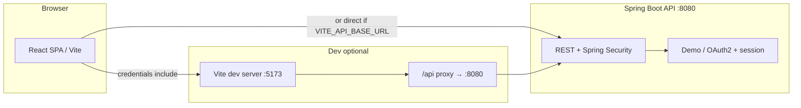
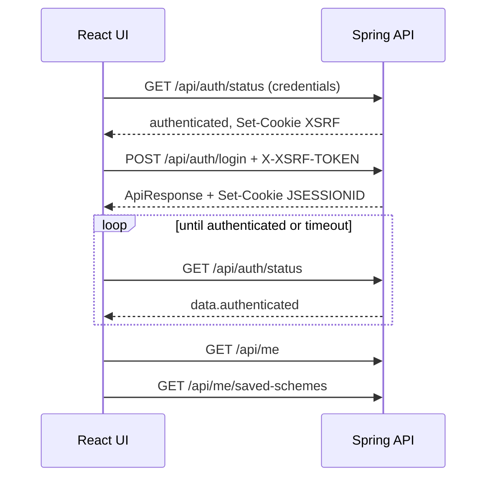

# Government Scheme Navigator — Frontend

React + Vite UI for discovering Indian government schemes: **paginated catalog**, **rule-based recommendations** from a structured profile, and **natural-language matching** (backend uses Gemini when configured).

## Prerequisites

- Node.js 18+ recommended
- Backend API running (default dev proxy targets `http://localhost:8080`)

## Environment variables

| Variable | Description |
|----------|-------------|
| `VITE_API_BASE_URL` | Recommended for **sign-in**: full API origin **without** a trailing slash (e.g. `http://localhost:8080`) so session and CSRF cookies are set on the Spring host. If unset, requests use relative `/api/...` (Vite dev proxy). |
| `VITE_AUTH_MODE` | Omit or any value except `oauth2` = **demo** login (`POST /api/auth/login`). Set to `oauth2` for **Google** redirect and `/auth/callback`. |

## Scripts

```bash
npm install
npm run dev
```

- **Dev server:** Vite (see terminal for local URL).
- **Production build:** `npm run build` — output in `dist/`.

Optional: `npm run backend` runs the packaged JAR from a sibling repo path; use only if that layout exists on your machine.

## Backend API & OpenAPI

- **Swagger UI:** `{BASE}/swagger-ui/index.html` (e.g. [http://localhost:8080/swagger-ui/index.html](http://localhost:8080/swagger-ui/index.html))
- **OpenAPI JSON:** `{BASE}/v3/api-docs` or `{BASE}/v3/api-docs/all`

The UI reads successful payloads from the standard envelope: `response.data` after unwrapping `success` / `error` (implemented in `src/app/api/client.ts`).

**Session (demo auth):** `GET /api/auth/status` (always 200) supplies `data.authenticated` and primes the CSRF cookie. Mutating calls send `X-XSRF-TOKEN` from the `XSRF-TOKEN` cookie. `GET /api/me` returning 401 while anonymous is normal and is not shown as a login error.

## UI flow

High-level journeys (all under a shared **root layout**: dev health banner, **navbar**, main content, **footer**).

### Anonymous (no sign-in)

1. **Landing (`/`)** — Hero and quick prompts; user can type a situation and go to **Match**, or use nav to **Catalog**, **My details** (recommend), or **Describe** (match).
2. **Catalog (`/catalog`)** — Browse paginated schemes from the API; each card can open a **summary** dialog (detail fetch). **Save** (heart) opens sign-in if not logged in.
3. **Recommend (`/recommend`)** — Structured profile form → `POST /api/schemes/recommend` → list of matching scheme cards.
4. **Match (`/match`)** — Free-text description (`?q=…` in URL after submit) → `POST /api/schemes/match` (English responses) → **Eligible** and **Near miss** sections with cards; results cached in `sessionStorage` for navigation.
5. **Scheme detail (`/scheme/:id`)** — Reads the last match result set from **session storage** (not the catalog API). Shows full narrative, eligibility, apply flow, **Quick actions** (including save). If the id is missing from the last session, shows “not found” and points back to Match.

### Authentication

6. **Demo login (default)** — **Sign in** opens a modal: email + password → `POST /api/auth/login`. On success, the app polls `GET /api/auth/status` until `authenticated: true`, then loads `GET /api/me` (with fallback to the login payload for display) and `GET /api/me/saved-schemes`. A toast confirms success. **Saved** appears in the navbar only when signed in.
7. **Google OAuth (`VITE_AUTH_MODE=oauth2`)** — **Sign in** redirects to Spring; return URL is **`/auth/callback`**, which refreshes session state and navigates to the stored return path. **Sign out** uses Spring’s `/logout` (full navigation).

### Signed-in

8. **My saved schemes (`/me/saved`)** — Lists saved entries from `GET /api/me/saved-schemes`; each row can open in-app detail or **Remove** (`DELETE` with CSRF). Anonymous users see sign-in prompt.
9. **Save / unsave** — Heart on catalog cards, match cards, and scheme detail calls `POST /api/me/saved-schemes` / `DELETE` when logged in; CSRF primed via `GET /api/auth/status` (or equivalent GET) before mutating requests.

### Errors & edge cases

- Invalid demo credentials: error text comes from the **login** `ApiResponse.error` only.
- Login HTTP success but session not visible on `GET /api/auth/status`: modal shows troubleshooting (proxy vs `VITE_API_BASE_URL` + CORS/cookies).
- Match **legacy** route: `/results?…` redirects to `/match?…` with the same query string.

## System design

### Architecture



- **SPA** — React 18, React Router 7, client-side routing; state for auth and saved schemes in **React context** (`AuthProvider`).
- **API access** — `fetch` with `credentials: 'include'` so `JSESSIONID` (and CSRF cookie) are sent on the Spring origin or same-origin `/api` in dev.
- **CSRF** — Before `POST`/`DELETE`, a safe **`GET`** (typically `/api/auth/status`) runs so `XSRF-TOKEN` is set; mutating requests send header **`X-XSRF-TOKEN`** (from cookie or response header). Implemented in `src/app/api/client.ts`.
- **Envelope** — JSON bodies use `ApiResponse`: `success`, `data`, `error`; client unwraps `data` or throws `ApiError`.

### Auth & session (demo)



Session truth is **`GET /api/auth/status`** (`data.authenticated`). The UI does **not** treat anonymous `GET /api/me` (401) as a failed login attempt.

### Data & caching

| Data | Storage | Notes |
|------|---------|--------|
| Last match results (for `/scheme/:id`) | `sessionStorage` | Written after match; scheme detail reads from here |
| Match query cache | `sessionStorage` | Keyed by query + language key (`en`) to avoid duplicate match calls |
| Auth user / saved list | React state | Refreshed from API on login, logout, save, unsave, and initial load |

### Key source files

| Area | Location |
|------|----------|
| Router + layout | `src/app/routes.tsx`, `src/app/App.tsx` |
| Auth context | `src/app/context/auth-context.tsx` |
| Auth + status + me + saved API | `src/app/api/auth-api.ts` |
| HTTP + CSRF | `src/app/api/client.ts` |
| Catalog / recommend / health | `src/app/api/schemes-api.ts` |
| NL match mapping | `src/app/api/match-schemes.ts` |
| Login modal | `src/app/components/auth-login-dialog.tsx` |
| Dev proxy | `vite.config.ts` (`/api` → backend) |

## App routes

| Path | Purpose |
|------|---------|
| `/` | Landing + quick “describe” search → `/match` |
| `/catalog` | `GET /api/schemes` — paginated cards; **View summary** loads `GET /api/schemes/{id}` |
| `/recommend` | `POST /api/schemes/recommend` — structured profile form |
| `/match` | `POST /api/schemes/match` — textarea; responses requested in English (`language: en`) |
| `/results?...` | Redirects to `/match` with the same query string (legacy) |
| `/scheme/:id` | Detail view for schemes stored from the last match session |
| `/auth/callback` | OAuth return: refresh session, then navigate home or return URL |
| `/me/saved` | Saved schemes list (`GET /api/me/saved-schemes`); **Saved** nav link only when signed in |

In **development**, a thin **health** strip calls `GET /api/health` (not shown in production builds).

## Project layout (API-related)

- `src/app/api/client.ts` — fetch wrapper, `ApiResponse` unwrap, `credentials: 'include'`, CSRF headers
- `src/app/api/types.ts` — DTOs aligned with OpenAPI
- `src/app/api/schemes-api.ts` — health, catalog list, scheme detail by id, recommend
- `src/app/api/match-schemes.ts` — natural-language match + mapping to UI `Scheme` model
- `src/app/api/auth-api.ts` — auth status, demo login/logout, me, saved schemes
- `src/app/api/scheme-results-storage.ts` — session storage for match results and match cache
